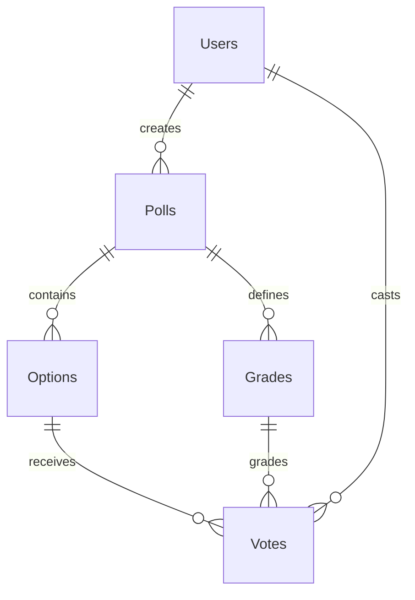

# Majority Judgement

マジョリティ・ジャッジメント（MJ）方式を採用した、より民主的で正確な意思決定を支援する投票プラットフォームです。

## 🌟 プロジェクト概要

従来の多数決（単記非移譲式）では、「死票」が多くなりがちで、中庸な意見が無視される傾向があります。本システムでは、各選択肢に対して「評価（Grade）」を付与し、その**中央値（Median）**に基づいて順位を決定することで、集団の納得感が最も高い結果を導き出します。

## 🛠 技術スタック

| レイヤー | 技術 |
|---|---|
| Frontend | React 18 / Vite / TypeScript / Tailwind CSS |
| Backend | FastAPI (Python 3.11+) |
| Database | PostgreSQL 16 |
| ORM | SQLAlchemy 2.0 (async) |
| Auth | JWT (python-jose) ※投票作成者のみ要認証、投票は匿名可 |
| CI/CD | GitHub Actions |
| Proxy / Server | Nginx / Docker & Docker Compose |

## 📋 機能一覧

- **投票フォーム作成**: ログインユーザーが選択肢・評価スケール・締め切り日時を設定して投票を作成
- **投票ページ**: 各選択肢に対してグリッド形式で多段階評価（最高〜不適切）を入力
- **匿名投票対応**: ログイン不要で参加可能。ブラウザトークンで重複投票を防止
- **結果確認ページ**: 各評価の割合を積み上げ棒グラフで可視化。メダル表示でランキングを提示
- **順位計算アルゴリズム**: MJ特有の中央値比較とタイブレーク処理（`backend/app/services/mj_algorithm.py`）
- **投票締め切り機能**: 作成者が手動で投票を終了可能

## 🧮 順位計算ロジック (Majority Judgment)

本システムでは、以下のアルゴリズムに基づいて順位を決定します。

### 1. 中央値の選定

各候補 C に対する n 個の評価を $g_1 \leq g_2 \leq \dots \leq g_n$ と並べたとき、中央値 M を算出します。

- n が奇数の場合: $M = g_{(n+1)/2}$
- n が偶数の場合: $M = g_{n/2}$（低い方の中央値を採用）

### 2. タイブレーク（順次除去法）

中央値 M が同一の候補が複数存在する場合、以下の手順を繰り返します：

1. 各候補から中央値 M と一致する評価を1つ取り除く
2. 残った評価群から新しい中央値を算出し、比較する
3. 差が出るまで、または評価がなくなるまで継続

## 🏗 システム構成

### ディレクトリ構造

```
Majority-Judgement/
├── backend/
│   ├── app/
│   │   ├── api/v1/          # APIエンドポイント (auth.py, polls.py, deps.py)
│   │   ├── core/            # 設定・JWT認証 (config.py, security.py)
│   │   ├── db/              # DB接続 (session.py)
│   │   ├── models/          # SQLAlchemyモデル (User, Poll, Option, Grade, Vote)
│   │   ├── schemas/         # Pydanticスキーマ
│   │   ├── services/        # MJアルゴリズム (mj_algorithm.py)
│   │   └── main.py          # FastAPIアプリエントリポイント
│   ├── Dockerfile
│   └── requirements.txt
├── frontend/
│   ├── src/
│   │   ├── components/      # Navbar, GradeBar, LoadingSpinner
│   │   ├── hooks/           # useAuth (JWT・ログイン状態管理)
│   │   ├── pages/           # ホーム / ログイン / 登録 / 投票作成 / 投票 / 結果
│   │   ├── types/           # TypeScript型定義
│   │   └── utils/           # api.ts (Axios), gradeColors.ts
│   ├── Dockerfile
│   ├── nginx.conf           # フロントエンド用Nginx設定
│   └── package.json
├── nginx/
│   └── nginx.conf           # リバースプロキシ設定
├── .github/
│   └── workflows/
│       └── ci.yml           # CI (lint + build)
├── docker-compose.yml
└── .env.example
```

### データベース・スキーマ



### API エンドポイント

| メソッド | パス | 認証 | 説明 |
|---|---|---|---|
| POST | `/api/v1/auth/register` | 不要 | ユーザー登録 |
| POST | `/api/v1/auth/login` | 不要 | ログイン・JWT取得 |
| GET | `/api/v1/polls` | 不要 | 投票一覧取得 |
| POST | `/api/v1/polls` | **必要** | 新規投票作成 |
| GET | `/api/v1/polls/{id}` | 不要 | 投票フォーム取得 |
| POST | `/api/v1/polls/{id}/vote` | 不要 | 投票実行（匿名可） |
| GET | `/api/v1/polls/{id}/results` | 不要 | 集計・順位結果取得 |
| PATCH | `/api/v1/polls/{id}/close` | **必要**（作成者） | 投票を締め切る |

## 🚀 セットアップ (ローカル開発環境)

### 前提条件

- Docker & Docker Compose がインストールされていること

### 起動手順

```bash
# リポジトリのクローン
git clone https://github.com/kono4649/Majority-Judgement.git
cd Majority-Judgement

# 環境変数の設定（必要に応じて編集）
cp .env.example .env

# Docker Composeによる起動
docker-compose up --build
```

起動後、以下のURLにアクセスできます：

| サービス | URL |
|---|---|
| フロントエンド | http://localhost:3000 |
| APIドキュメント (Swagger) | http://localhost:8000/docs |
| PostgreSQL | localhost:5432 |

### デフォルト評価スケール

| ラベル | 値 |
|---|---|
| 最高 | 5 |
| 優良 | 4 |
| 良好 | 3 |
| 普通 | 2 |
| 不良 | 1 |
| 不適切 | 0 |

投票作成時にラベルをカスタマイズできます。

## 🔄 CI/CD

GitHub Actions (`/.github/workflows/ci.yml`) により、`main` / `claude/**` ブランチへのプッシュ時に以下が自動実行されます：

- **backend-test**: Python 3.11 環境でバックエンドの lint チェック
- **frontend-build**: Node.js 20 環境でフロントエンドのビルド検証
